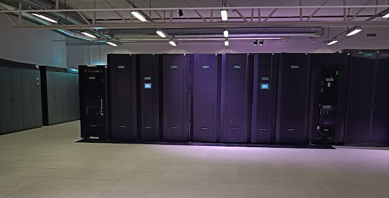

# New system Arrhenius

## Background

End-of-life of Alvis, Tetralith and Dardel

- Alvis (GPU and AI) Summer 2026
- Tetralith Autumn 2026
- Dardel Dec 2026-27

## What is Arrhenius?

- This is the new HPC cluster by NAISS.
- Vast increase of GPU performance
- Reduced amount of nodes available for CPU calculations
- Decrease in storage facility
- Sensitive partition Arrhenius-SENS replacing Bianca/Maja for non-UU users

- 2027: Just Arrhenius on national level is up and running.

## What will happen?

- Active projects running on Alvis, Tetralith and Dardel will be migrated to the new system.
- Timeline

  - Alvis: Summer
  - Tetralith: Fall
  - Dardel: End of year.
  - Bianca/Maja: End of year

- Local clusters, like Kebnekaise, Pelle and Cosmos available for local university users several more years.

## Hardware overview 

- A HPC partition with 424 AMD Turin 128-core CPUs and 382 GPU nodes, each with four Grace Hopper Superchips from NVIDIA
- One partition for persistent computing and data with a cloud interface
- One partition dedicated to sensitive data
- A fast 29 PB parallel file system for storage

More technical information here: [Arrhenius technical info](https://www.naiss.se/resources/arrhenius-technical-description/) 

## References

- <a href="https://hpc.pages.naiss.se/user-documentation/support-docs/arrhenius_hpc/quickstart/" target=_blank">Arrhenius quickstart guide (WIP)</a> 
