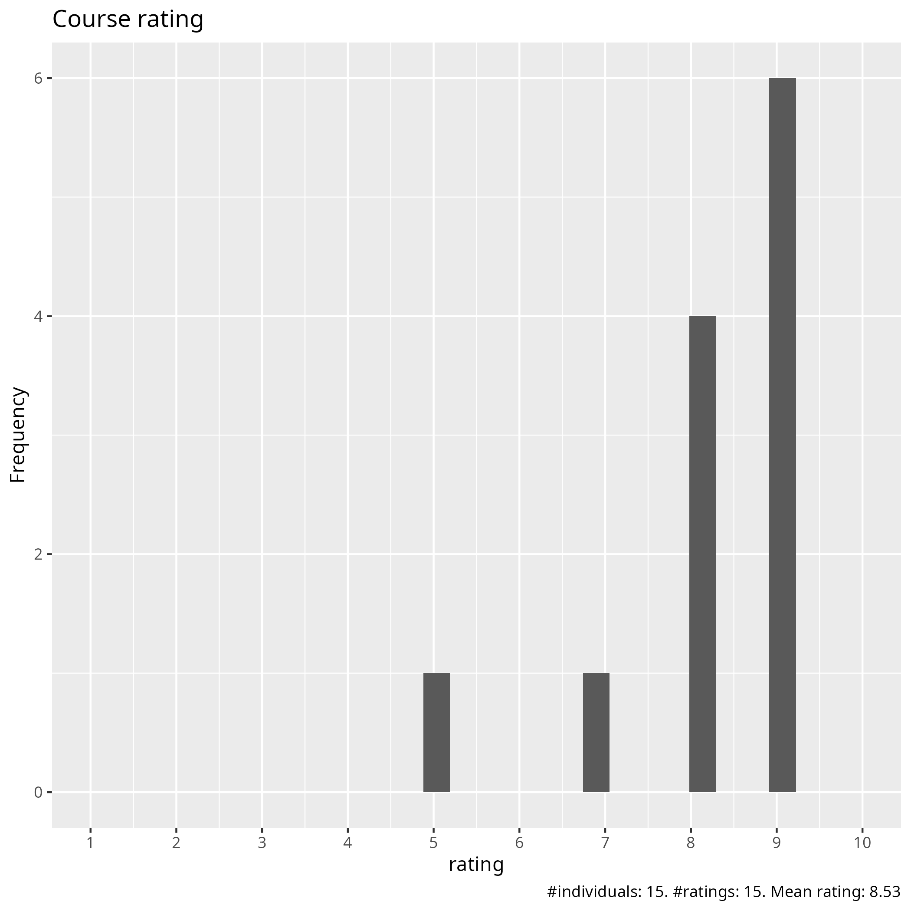
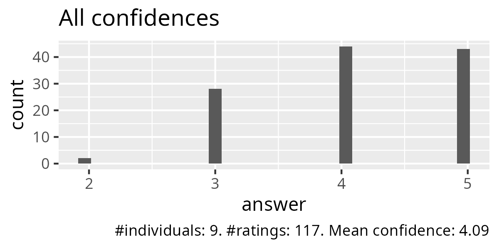
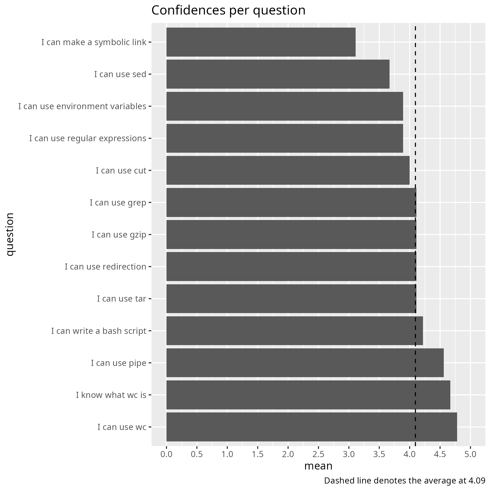
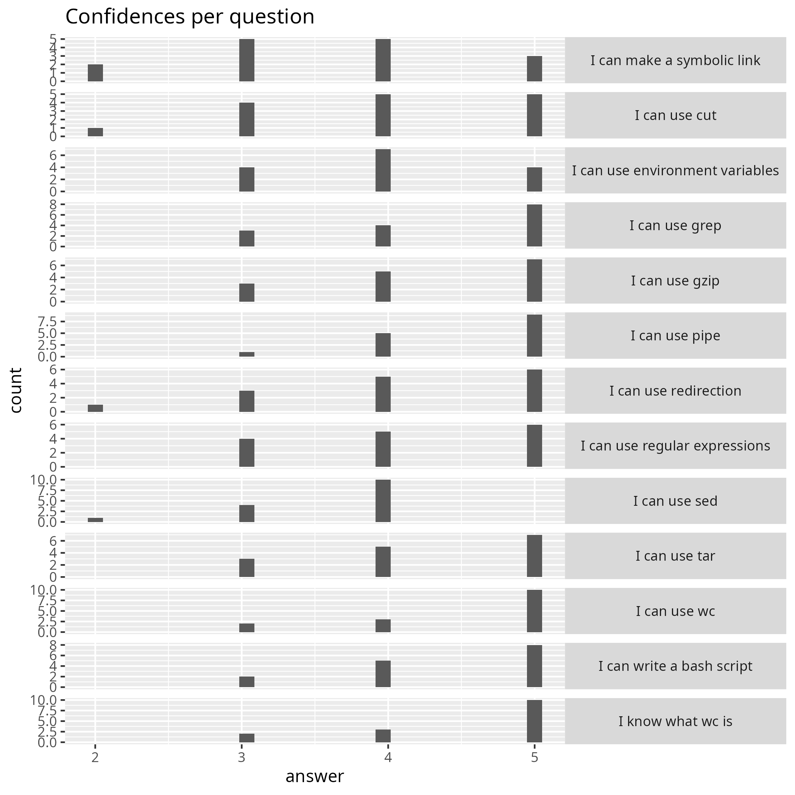
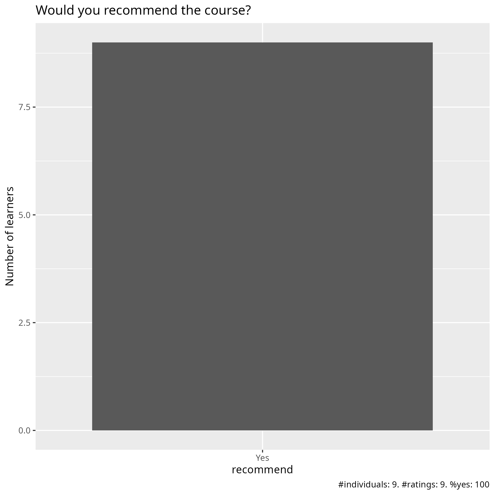

# Evaluation 2025-12-04 and 2025-12-05

- Date: 2025-12-04 and 2025-12-04
- Number of registrations: 74
- Number of learners on Day 1:
    - Showing up: 26 (35% showing up)
    - Being present most of the time: 21 (81% actively participating)
- Number of filled-in evaluations: 9 (on the same day, 43%) and 15 (within 2 weeks, 71%)
- [Reflection by Richel](../../reflections/202512_course/README.md)

## Analysis

- [Evaluation results (csv)](results.csv)
- [Evaluation results (xlsx)](results.xlsx)
- [Analysis script](analyse.R)
- [Average confidence per question (.csv)](average_confidences.csv)
- [Success score](success_score.txt): 82% (on the same day),
  83% (within 2 weeks)

### [Pace](pace.txt)

- ok
- Fast. But a lot to cover
- Bit fast
- Very appropriate, good timing
- The pace of the redirection session was too fast for me.
- It's good
- I thought the overall pace of the course was very good, especially comparing it to the Linux101 course. I liked the type-alongs especially from the first day.
- Mostly good. Some exercises maybe didn't get enough time, but since they're easy to follow and available online I feel happy doing them at my own speed later.
- Good! Maybe 5% too fast at some points
- Good.
- Good
- It was adequate
- good pace of teaching, easy to follow, enough time for the excercises
- Overall very good

### [Future topics](future_topics.txt)

- conda & environments/git
- AWK
- More specifically using Linux at an HPC cluster, for example starting jobs from scripts and good heuristics related to that.
- job resources, partitions, practical examples of how to use the resources
- Parallel computation in python

### [Other comments](comments.txt)

- I liked both: "type along" and "break out rooms" with a teacher jumping in
  to check if all is going well
- It was great, level and pace were perfect in my opinion!
- I finally understood regular expressions.
  Training organization was good. For the amount of material,
  the course is too short but the organizers managed to still
  deliver information efficiently.
  Course material was well prepared and hands on exercises
  (with the provided option of taking them in groups or individually)
  were extremely helpful.
- I understand its hard to select what materials to have in a course,
  especially when you are only running it for the second time
  and of course all knowledge is good knowledge.
  But it might be good to have another look at what takes
  the most time and if it has to take so much time.
  I appreciated Richels exercises a lot as the latter/more advanced ones
  were clearly labelled optional,
  and there were good instructions for what to do
  when finished or uninterested.
  I appreciated the type-alongs and they worked especially well
  on the first day.
  The second day had a bit too much information
  and different options in text,
  and i found myself a bit confused about what the actual difference was
  and what things i could type along with and
  what i didnt have the tools for executing
- Exercises and materials are very good overall,
  they're very useful for future reference as well.
  I think the instruction was sometimes unclear or too fast.
  I think what cause my confusion was starting by explaining a command
  quite abstractly and very technically.
  Its much easier to grasp its use case and what it does with the examples,
  so before that any explanation is hard to grasp.
- A great course of a very good size (contentwise) and teaching tempo.
  All things I have encontered and was not confident with have been covered
  incl. grep, Bash, awk!
  The only desire is to keep the terminal window wide
  or something when sharing so that command lines are not wrapped
  to several lines which often makes it difficult to read.
  Otherwise, thank you for the great course!
- This course didn’t do it for me. Most things were too easy,
  I misinterpreted the level when signing up.
  The exercises were fine I guess, but I didn’t like the Bash scripting e-book,
  it doesn’t explain anything.
  The official documentation is much better
  (https://www.gnu.org/software/bash/manual/html_node/index.html#SEC_Contents).
  For example, the page in the book about conditionals has this
  example `if [[ "${username}" == "${admin}" ]] ` which isn't understandable
  without explaining how Bash variable expansion works, and neither
  the curly braces nor the quotes are actually needed in this case.
  But again, I recognize that I'm not who this course is for.
- is a really good course
- I liked the structure of the self-learning exercises.
  It is also good to provide the solution to the exercises hidden,
  so one can go back an check.
- A bit more practical exercises and maybe some real world use cases if that
  is possible. I always use history | grep command since that is amazing.
  I really liked Richels style of teaching
  that was very nice and more practical.
