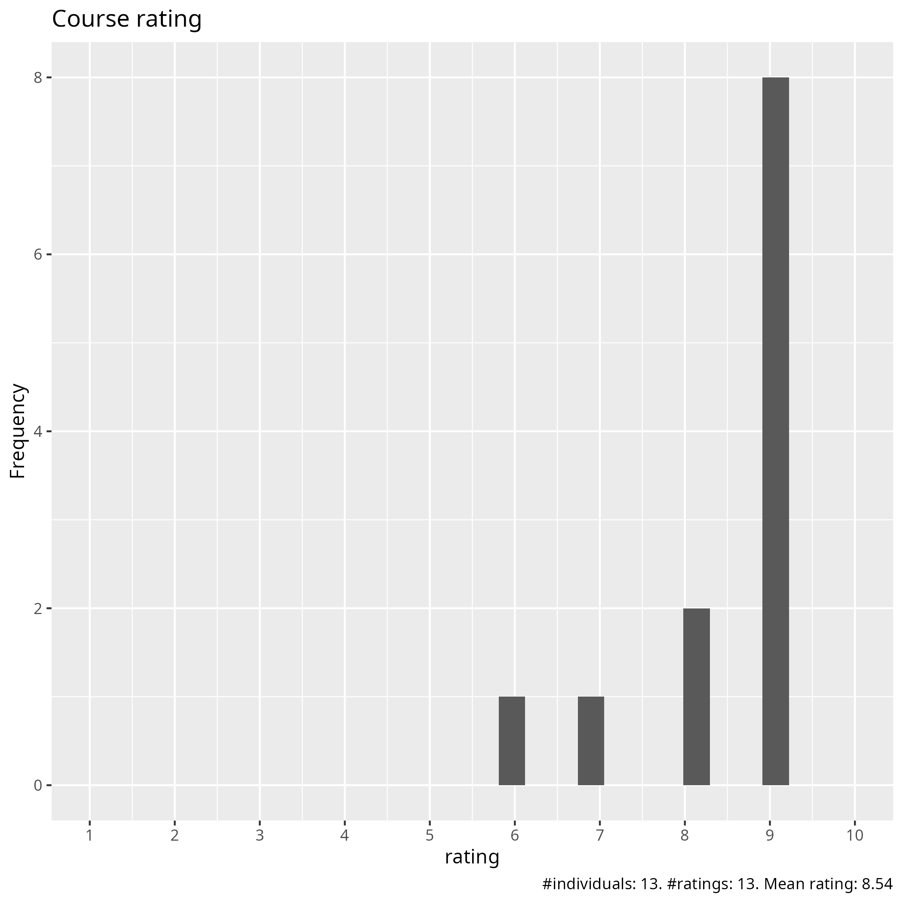
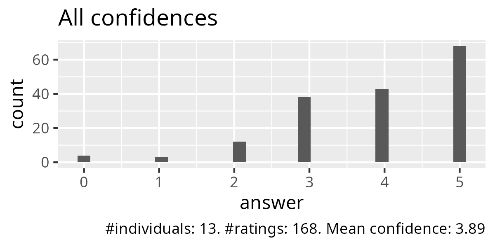
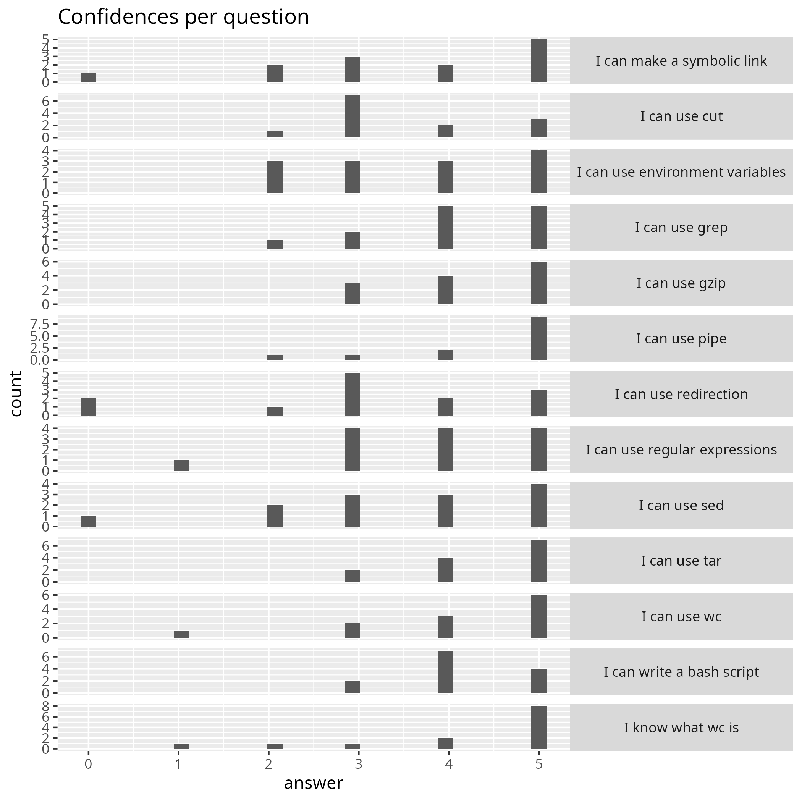
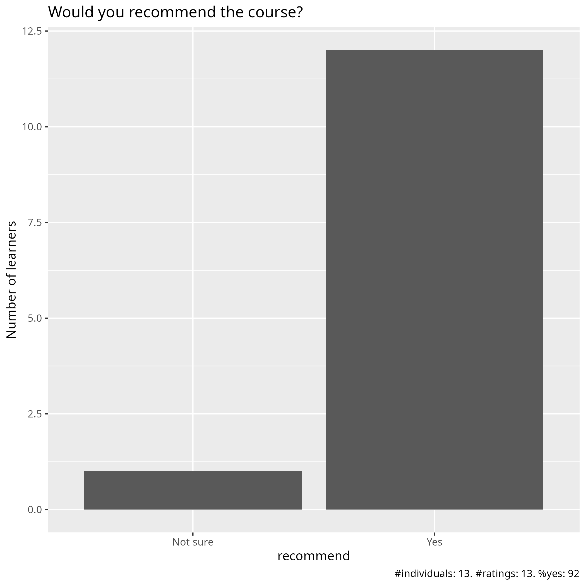

# Evaluation 2026-02-04

- [Lesson plan](../../lesson_plans/20260204/README.md)
- [Evaluation](../../evaluations/20260204/README.md)
- [Reflection by Richel](../../reflections/202602_course/README.md)
- Date: 2026-02-04
- Number of registrations: 64
- Number of learners: 19 (30% show-up rate)
- Number of filled-in evaluations: 13 (so far) (68% fill-on rate (so far))

## Analysis

- [Evaluation results (csv)](responses.csv)
- [Analysis script](analyse.R)
- [Average confidence per question (.csv)](average_confidences.csv)
- [Success score](success_score.txt): 78% (so far)

### [Pace](pace.txt)

- Nice, good to follow
- fine
- I think it was a good pacing.
  Sometimes a little more time might have been needed for the excercises.
- great! I managed to follow along
- Most of lectures were rather fast, and not much time for exercises
- The exercises are good to be hands on,
  I think this helps set the pace in a more authentic manner.
- Good pace, but maybe too intense for one day
- It was good. I did't finish all the excercises on on the time given
  but I didn't feel lost because of it
  and I know I can do them another time
- Generally good pace, sometimes a bit too fast
  (ex. 3min to try things yourself)
- fine
- The pace was ok if one have some experience, otherwise probably a bit fast.

### [Future topics](future_topics.txt)

- Use more data-minded command line tools like nco or ncks
- handling climate data, using python from the HPC,
  using some climate model like WRF
- How to use grep/cut with real ML applications in a real Alvis simulation:
  from start to finish. Also, Richel's podcast (see additional comments))
- Troubleshooting scripts
- More advanced trips and tricks for bash or linux in general

### [Other comments](comments.txt)

- I think all exercises should have solutions and the solutions
  should be more detailed.
  This would help me most understanding the topics.
- Both teachers today were very nice and educational. I feel like I learned a lot.
- The course materials are very good, though lectures were rather fast,
  but one can go back to the course materials
- There are lots of items, I don't think it is fair that we expect
  all the students to understand EVERYTHING at the HIGHEST level.
  There are already material available that we can study in more detail.
  If NAISS every wants to make a podcast to share the knowledge
  of the talented members it has, Richel is awesome.
  He makes this distant course really engaging and fun,
  so more of the Linux commands stays in our heads!
- I'm happy with the content of the course, adequate to beginners.
  I'm also satisfy with the performance of the teachers.
  I would suggest more time for doing exercises.
- I really like Richell energy and personal attention.
  It is very easy to follow and understand.
  Thank you both for the course.
- Super great material including good practices,
  downloadable via Github. Richel did a great job with keeping people engaged.
  I liked his questions in the beginning of each session!
  I know its hard to keep participants engaged, they're often too shy!
- The material was very useful although it was so detailed
  that it wasn't really necessary to follow the course after having gone
  through the material in my own time.
  Having Q&A documents was great, I'll remember that for my own teaching!
  Thanks Richèl for spreading a good vibe!
- A very good and wide‑ranging course in Linux.
  The teaching style—with questions, discussions,
  and Zoom breakout rooms—was new to me but also fun.
  It kept the audience engaged and focused throughout.
