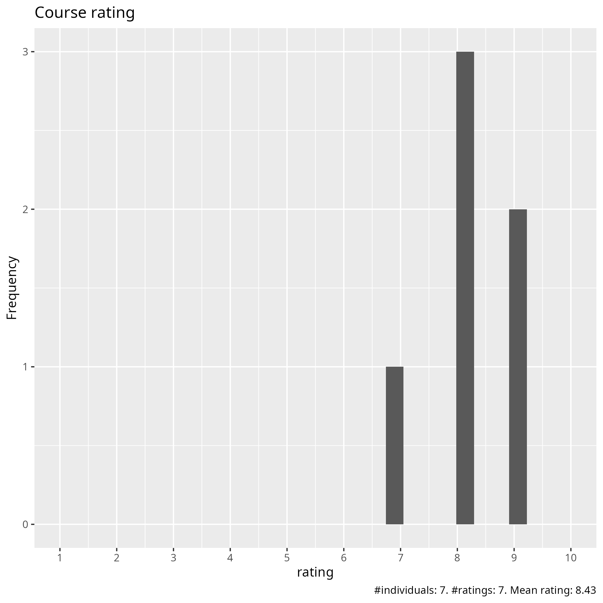
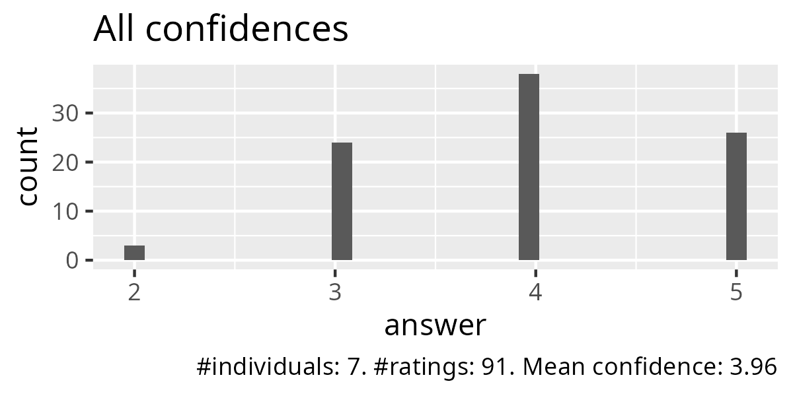
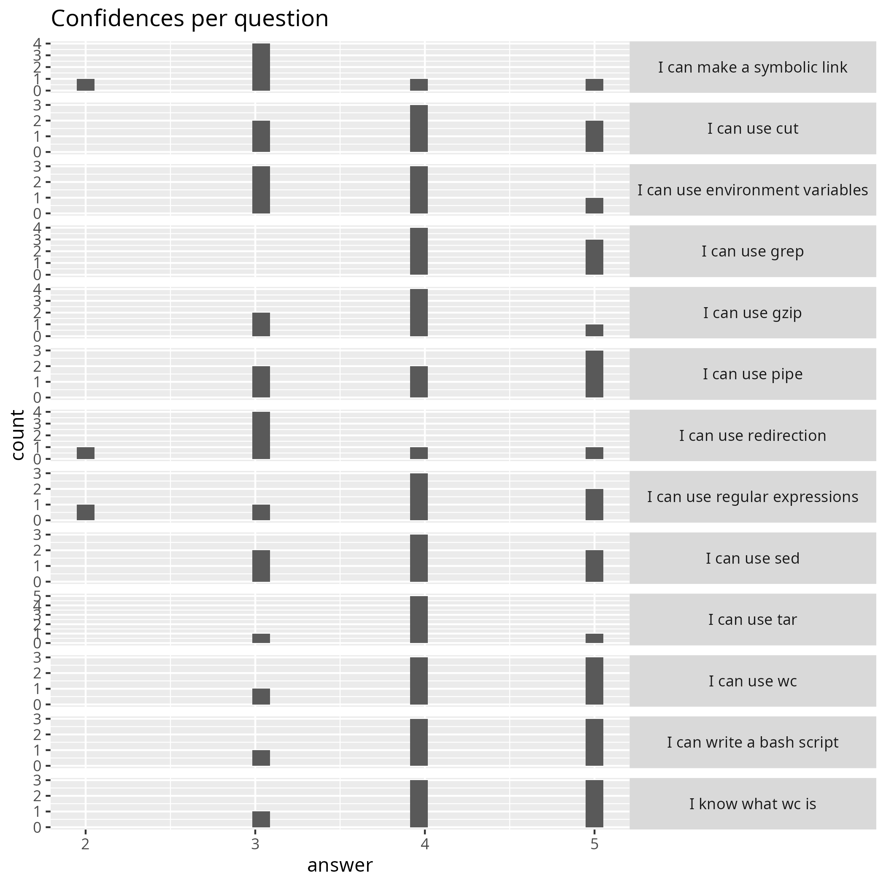

# Evaluation 2026-06-03

- Date: 2026-06-03
- [Lesson plan](../../lesson_plans/20260603/README.md)
- [Evaluation](../../evaluations/20260603/README.md)
- [Reflection by Richel](../../reflections/20260603/README.md)
- Number of registrations: 55
- Number of learners: 13 (24% show-up rate)
- Number of filled-in evaluations: 7 (54% fill-on rate)
- [Success score](success_score.txt): 79%

## Analysis

- [Evaluation results (csv)](survey.csv)
- [Analysis script](analyse.R)
- [Average confidence per question (.csv)](average_confidences.csv)

### [Pace](pace.txt)

- Richael is a very nice teacher
- Great
- It was a bit fast.
  I think it would benefit from going thorugh the exercises together briefly
  after we have done them each, to discuss any questions/issues in the group.
- First it was i a bit fast but then it was better-
- Overall good but as a first timer I need to go away and consolidate
- overall was good but in my opinion Birgitte goes a bit fast on the topics,
  especially on definitions
- Good

### [Future topics](future_topics.txt)

- I would like future training on Bash scripting for HPC workflows, job submission scripts, environment modules, data processing with grep/sed/awk, and practical examples for scientific computing.
- More bash scripting
- AI, Data Analytics, ML, Docker etc.

### [Other comments](comments.txt)

- I really appreciated the hands-on structure of the course.
  The exercises were useful and helped me understand Linux commands
  by practicing them directly in the terminal.
  The explanations were clear, and the pace was generally good.
  As a suggestion, it would be helpful to include a short summary table
  of the most important commands at the end of each session,
  with examples and common mistakes.
  This would be especially useful for beginners or participants
  who are new to HPC environments.
  Overall, I found the course very helpful and well organised.
  Thank you for the training.
- All was just fine thank you

