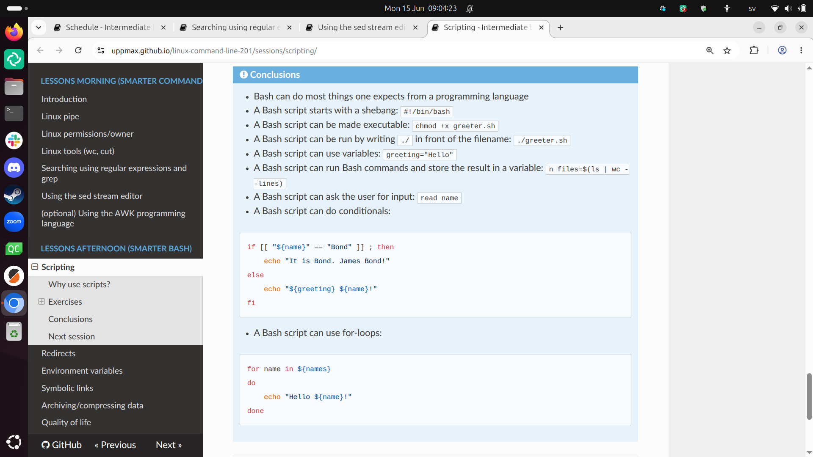
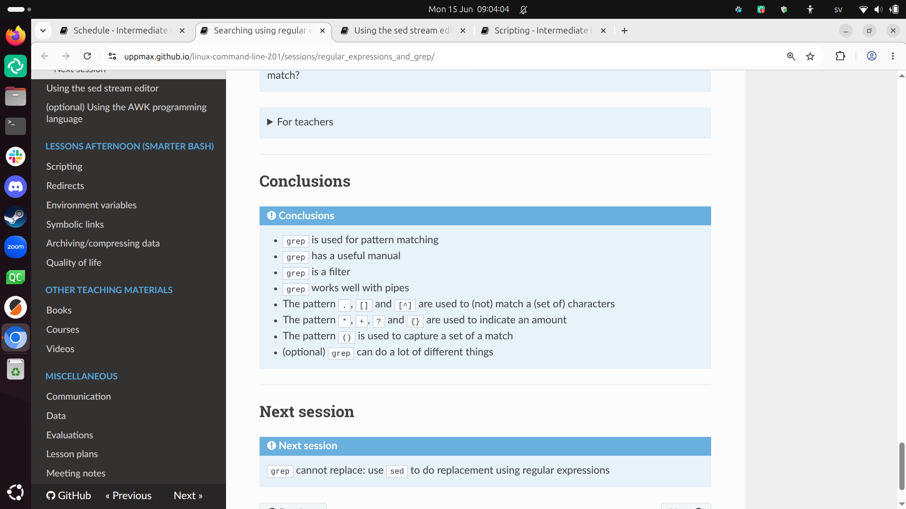
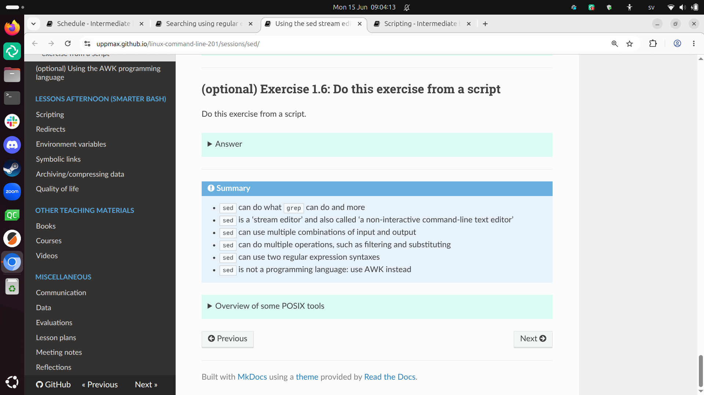

# Reflection 2026-06-03

- [Lesson plan](../../lesson_plans/20260603/README.md)
- [Evaluation](../../evaluations/20260603/README.md)
- [Reflection](../../reflections/20260603/README.md)

## During teaching

I enjoyed the contact with the learners.
I have spoken to all of them 1-on-1.
There were some for which the content
was too easy, whom I sent on an early break/lunch.

I do think the course name 'Command Line 201'
is a misnomer: I feel it should be called
'Command Line 102', as it is quite basic what
we are teaching.

What I noticed is that 9 out of 10 learners
stated that, during the 'Bash scripts' session,
that this is their first time creating a Bash
script. This means they did not even remember
when it was taught twice before! The other 1 learner
was already experienced in Bash, so I did not ask
her if she remembered the sessions on Bash. 

I enjoyed working together with the other teacher:
when we requested host/co-host Zoom right, we just did
that, gave a thumbs up and gave a thumbs up back. It was smooth!

I predict at least 1 learner will write on the evaluation
that the course went too slow. I agree that when being gifted
like here, where we follow the pace of most of the learners,
one is better off elsewhere or by self-study.

## Evaluation results

Here I go through the evaluation results.
I do fix typos.

### [Pace](../../evaluations/20260603/pace.txt)

- Good
- Great

Yay :-) .

- Richel is a very nice teacher

Great

- It was a bit fast.
  I think it would benefit from going thorugh the exercises together briefly
  after we have done them each, to discuss any questions/issues in the group.

Yes, I agree I should practice my Feedback more.

- [ ] Schedule Feedback

- First it was i a bit fast but then it was better

I wish I knew which sessions 'first' included.

- Overall good but as a first timer I need to go away and consolidate

I agree practice after the course will be helpful.

- overall was good but in my opinion Birgitte goes a bit fast on the topics,
  especially on definitions

Not my session.

### [Future topics](../../evaluations/20260603/future_topics.txt)

- I would like future training on Bash scripting for HPC workflows,
  job submission scripts, environment modules,
  data processing with grep/sed/awk,
  and practical examples for scientific computing.
- More bash scripting
- AI, Data Analytics, ML, Docker etc.

### [Other comments](../../evaluations/20260603/comments.txt)

- I really appreciated the hands-on structure of the course.
  The exercises were useful and helped me understand Linux commands
  by practicing them directly in the terminal.
  The explanations were clear, and the pace was generally good.
  As a suggestion, it would be helpful to include a short summary table
  of the most important commands at the end of each session,
  with examples and common mistakes.
  This would be especially useful for beginners or participants
  who are new to HPC environments.
  Overall, I found the course very helpful and well organised.
  Thank you for the training.

I see I already do a mediocre job at this:

The `sed` session is the worst in this case: it does not show actual
usage of `sed`.

I think I can expand a bit on this. Adding common mistakes is something
I consider: I have exercises exactly for encountering common mistakes.

- [ ] Consider expanding summary at the end of a session

- All was just fine thank you

## Conclusion

I should continue working on my Feedback.
