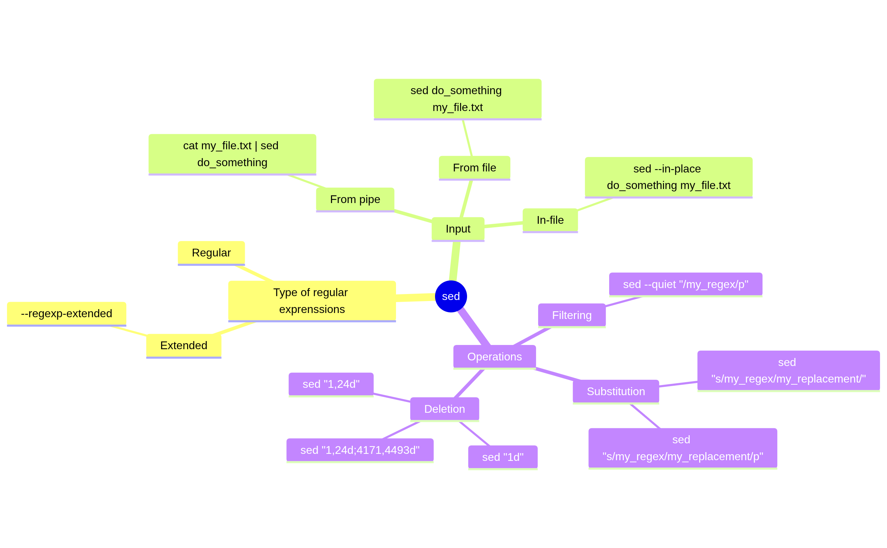

---
tags:
  - session
  - lesson
  - sed
  - regular expressions
  - stream editor
---

# Replacing using regular expressions and `sed`

???- note "Need a video?"

    ...

!!! info "Learning outcomes"

    - Learners can use `sed`
    - Learners have practiced using the `sed` manual
    - Learners can use `sed` to replace text
    - Learners can send text to `sed` using a pipe
    - (optional) Learners have seen the flexibility of `sed`

???- note "For teachers"

    Lesson plan:

    Time         |Minutes|Duration|Description
    -------------|-------|--------|---------
    11:20-10:30  |0-10   |10      |Prior
    11:30-10:35  |10-15  |5       |Present
    11:35-10:55  |15-35  |20      |Challenge
    11:55-12:09  |35-45  |10      |Feedback and conclusion

    Prior:

    - How to replace text with `grep`?
    - In Linux, which two types of documentation are
      available from the command line?
    - What is `sed`?
    - `sed` is a stream editor. What would that mean?
    - `sed` is a stream editor that can filter text. What would that mean?
    - `sed` is a stream editor that can transform text. What would that mean?

## Why use `sed`?

`sed` is among
[the list of 'Portable Operating System Interface' (POSIX) commands](https://en.wikipedia.org/wiki/List_of_POSIX_commands),
which means it is considered a fundamental tool
and is likely to be available on your operating system.

`sed` can do what `grep` can do` and more:
it can **replace** text that is found by regular expression matches.

## Overview



## Types of operations

### Filtering

`sed` can do what `grep` can do`.
For example, in the session about `grep`,
we used the following command:

```bash
man grep | grep "^[A-Z]"
```

The equivalent `sed` command is this:

```bash
man grep | sed --quiet "/^[A-Z]/p"
```

???- question "Are there synonyms for this `sed` command?"

    Yes, these commands are all equivalent:

    ```bash
    man grep | sed --quiet "/^[A-Z]/p"
    man grep | sed --silent "/^[A-Z]/p"
    man grep | sed -n "/^[A-Z]/p"
    ```

    In this session, `--quiet` is used, as it is felt to be 
    the most self-explanatory: to me, 'quiet' feels that it may
    not be perfectly 'silent'.

### Replacing

Probably the most used feature of `sed` is its replacement
functionality:

```bash
sed 's/[regular_expression]/[replacement]/'
```

The `s` is short for 'substitute'. For example, the command
below substitutes 'morning' for 'afternoon'.

```bash
echo "Good morning" | sed 's/morning/afternoon/'
```

???- question "What is the output of that command?"

    ```
    Good afternoon
    ```

If there may be multiple matches in a sentence, add `g` at the end:

```bash
echo "Good morning, good morning" | sed 's/morning/afternoon/g'
```

???- question "What is the output of that command (with the `g`)?"

    ```bash
    Good afternoon, good afternoon
    ```

???- question "What is the output of that command without the `g`?"

    ```bash
    Good afternoon, good morning
    ```


### Deleting

Another commonly used feature of `sed` is its line deletion
functionality:

<!-- markdownlint-disable MD013 --><!-- Tables cannot be split up over lines, hence will break 80 characters per line -->

`sed` command                     |Description
----------------------------------|--------------------------------------------------------------------
`cat my_file.txt | sed '1d'`      |Delete the first line
`cat my_file.txt | sed '1,3d'`    |Delete lines 1 to and including 3
`cat my_file.txt | sed '1,3;7,9d'`|Delete lines 1 to (and including) 3 and lines 7 to (and including) 9

<!-- markdownlint-enable MD013 -->

## Input and output

<!-- markdownlint-disable MD013 --><!-- Tables cannot be split up over lines, hence will break 80 characters per line -->

`sed` command                                           |Input and output
--------------------------------------------------------|---------------------------------------------------
`cat my_input_file.txt | sed '1d'`                      |Get input from a pipe, write output to terminal
`cat my_input_file.txt | sed '1d' > my_output_file.txt` |Get input from a pipe, write output to another file
`sed '1d' my_input_file.txt`                            |Get input from a file, write output to terminal
`sed '1d' my_input_file.txt > my_output_file.txt`       |Get input from a file, write output to another file
`sed --in-place '1d' my_file.txt`                       |:warning: Modify the file directly

<!-- markdownlint-enable MD013 -->

## Type of regular expressions

There are two types of regular expressions
present in `sed` [according the `sed` manual](https://www.gnu.org/software/sed/manual/sed.html#Regular-Expressions-Overview):
basic and extended regular expressions.

Here is a quote from
[the `sed` manual](https://www.gnu.org/software/sed/manual/sed.html#BRE-vs-ERE)
regarding their differences:

> In GNU sed, the only difference between basic and extended regular
> expressions is in the behavior of a few special characters:
> `?`, `+`, parentheses, braces (`{}`), and `|`.

The difference can be shown using this text:

```text
Bland
England
Gland
Holland
```

To select the countries, use:

```
cat lands.txt | sed --quiet '/[A-Z][a-z][a-z]*land/p'
cat lands.txt | sed --quiet --regexp-extended '/[A-Z][a-z]+land/p'
```


## Exercises

## Exercise 1: use the `sed` manual

In this exercise, we'll use the `sed` manual.

---

### Exercise 1.1: view the `sed` manual

View the `sed` manual.

??? tip "The command to view a manual"

    `man` is the command to view a manual

??? tip "Answer"

    In the terminal, type:

    ```bash
    sed grep
    ```

    Use the arrow keys to navigate and `q` to quit

---

### Exercise 1.2.1: what is `sed`, definition 1?

According to the `sed` manual, **in a one-liner**, what is `sed`?

Tip: it is at the top.

??? tip "Answer"

    `sed` is a 'stream editor for filtering and transforming text'.

    It is in the fourth line:

    ```console
    SED(1)                                User Commands                                SED(1)

    NAME
           sed - stream editor for filtering and transforming text
    ```


### Exercise 1.2.2: what is `sed`, definition 2?

According to the online `sed` manual at
[https://www.gnu.org/software/sed/](https://www.gnu.org/software/sed/),
what is `sed`? What does that definition mean?


??? tip "Answer"

    At [https://www.gnu.org/software/sed/](https://www.gnu.org/software/sed/)
    the first line reads:

    > `sed` is 'a non-interactive command-line text editor

    It means that you can let `sed` work on your file (like you
    do with e.g. `nano`) without you opening the file.

---

### Exercise 1.3: view the `sed` info page

View the `sed` info page.

??? tip "The command to view an info page"

    `info` is the command to view an info page.

??? tip "Answer"

    In the terminal, type:

    ```bash
    info grep
    ```

    Use the arrow keys to navigate and `q` to quit

---

## Exercises

In this exercise, we will work Macbeth, a tale written by William Shakespeare.

Download the file from a terminal as such:

```bash
wget https://raw.githubusercontent.com/UPPMAX/linux-command-line-201/refs/heads/main/docs/sessions/sed/macbeth.txt
```

In these exercises, we will:

- Remove the copyright:
  it will be more pleasant to read
- Replace 'Weird Sisters' by 'witches':
  the text will be more clear
- Replace all country names by 'Sweden' (or your favorite country):
  the text may be funnier to read :-)
  
## Exercise x: use `sed` to find text from standard input

Read the session [replacing with `sed`](#replacing__with__sed).

In Macbeth, there are many placenames ending on `land`.

Search for all placenames ending on `land` using `sed`.
To be precise: search for all matches of (1) starting with an uppercase
character, (2) have zero or more lowercase characters, (3) end on `land`.

Do so by using `cat` on the file `macbeth.txt`,
then piping it to `sed`.

???- question "Answer"

    ```bash
    cat macbeth.txt | sed --quiet '/[A-Z][a-z]*land/p'
    ```

Your non-Swedish non-Finnish colleague comes to you
and states that your regular expression
makes no sense: your regular expression matches
'Aland', 'Bland', 'Cland' (and 'Gland'), which can be improved
upon.

???- question "Why is the colleague non-Swedish non-Finnish?"

    Because he/she does not know that Sweden has an island called
    Öland and Finland has an island called Åland.

Search for all placenames ending on `land` using `sed`.
To be precise: search for all matches of (1) starting with an uppercase
character, (2) have **one** or more lowercase characters, (3) end on `land`.

You will need to use the extended regular expressions.

???- question "Answer"

    ```bash
    cat macbeth.txt | sed --quiet --regexp-extended '/[A-Z][a-z]+land/p'
    ```

## Exercise x: use `sed` to replace text from standard input

Read the session [replacing with `sed`](#replacing__with__sed).

In Macbeth, replace `Weird Sisters` (both words start with an upper-case
character) by `witches`. Do so by using `cat` on the file `macbeth.txt`,
then piping it to `sed`.

???- question "Answer"

    Here is how to show the text of Macbeth, with the text replaced:

    ```bash
    cat macbeth.txt | sed 's/Weird Sisters/witches/'
    ```

    There is no need to end with a `g`, as doing so (see command below) gives
    identical results:

    ```bash
    cat macbeth.txt | sed 's/Weird Sisters/witches/g'
    ```

    You can check in many ways that `Weird Sisters` only occurs once per
    line. For example, the command below gives no matches:

    ```bash
    cat macbeth.txt | grep "Weird Sisters.*Weird Sisters"
    ```

Check that your replacement worked.

???- tip "Tip"

    Pipe the output to `grep` to detect matches with `witches`

???- question "Answer"

    ```bash
    cat macbeth.txt | sed 's/Weird Sisters/witches/g' | grep witches
    ```

    This gives the output:

    ```
    The witches, hand in hand,
    title, before, these witches saluted me, and referred me to the
    I dreamt last night of the three witches:
    (And betimes I will) to the witches:
    Saw you the witches?
    ```

???- question "How to save to a file?"

    You can redirect the output to a file using `>`, e.g.:

    ```bash
    cat macbeth.txt | sed 's/Weird Sisters/witches/g' > macbeth_with_witches.txt
    ```

## Exercise x: use `sed` to remove a line from standard input

In this exercise, we use `sed` to remove lines from standard input,
i.e. from using `cat` on a file

The Macbeth text contains a copyright notice at the start and end of it.

Find the line where the copyright notice at the start ends.

```
cat -n macbeth.txt  | head -n 100
```

This gives:

```text
    22  
    23  *** START OF THE PROJECT GUTENBERG EBOOK THE COMPLETE WORKS OF WILLIAM SHAKESPEARE ***
    24  
    25  THE TRAGEDY OF MACBETH
    27  
```

Remove the lines in such a way that the first line will be
`THE TRAGEDY OF MACBETH`.

```bash
cat macbeth.txt | sed '1,24d' 
```

To check:

```bash
cat macbeth.txt | sed '1,24d'  | head 
```


## Exercise x: use `sed` to replace text from a file

In this exercise, we use `sed` directly on a file.
Below are two syntaxes that are equivalent.

```bash
cat macbeth.txt | sed '1,24d'
sed '1,24d' macbeth.txt
```

In the Macbeth text, there is a copyright notice at the bottom too,
starting with `START: FULL LICENSE`

Find out in which line the copyright notice starts.

```bash
cat -n macbeth.txt | grep "START: FULL LICENSE"
```

```
richel@richel-latitude-7430:~/GitHubs/linux-command-line-201/docs/sessions/sed$ cat -n macbeth.txt | grep "START: FULL LICENSE"
  4171	START: FULL LICENSE
```

Find out how many lines the file has.

```
richel@richel-latitude-7430:~/GitHubs/linux-command-line-201/docs/sessions/sed$ cat -n macbeth.txt | tail
  4484	
  4485	Most people start at our website which has the main PG search
  4486	facility: www.gutenberg.org.
  4487	
  4488	This website includes information about Project Gutenberg™,
  4489	including how to make donations to the Project Gutenberg Literary
  4490	Archive Foundation, how to help produce our new eBooks, and how to
  4491	subscribe to our email newsletter to hear about new eBooks.
  4492	
  4493	
```

```bash
richel@richel-latitude-7430:~/GitHubs/linux-command-line-201/docs/sessions/sed$ wc macbeth.txt 
  4493  21234 129047 macbeth.txt
```

```bash
richel@richel-latitude-7430:~/GitHubs/linux-command-line-201/docs/sessions/sed$ wc macbeth.txt --lines
4493 macbeth.txt
```


```bash
sed '1,24d;4171,4493d' macbeth.txt
```

```bash
sed '1,24d;4171,4493d' macbeth.txt | head
```

```bash
sed '1,24d;4171,4493d' macbeth.txt | tail
```

(optional) Do this exercise without remembering the lines

## Exercise x: use `sed` to replace text in a file

Until now, we never have touched the original file.
Here we use `sed --in-place [commands] [filename]`
to directly work on the original file.

```bash
sed --in-place 's/Weird Sisters/witches/g' macbeth.txt
```

## Exercise x: use `sed` to remove lines in a file

Print without copyright:

```bash
sed --quiet '27,4170p' macbeth.txt
```

Print without copyright:

```bash
sed --in-place --quiet '27,4170p' macbeth.txt
```

## Replace

```bash
cat macbeth.txt | egrep "[A-Z][a-z]+land"
```

```
cat macbeth.txt | sed --regexp-extended 's/[A-Z][a-z]+land/Holland/g' | grep -i land
```


# sed

## Syntax

```bash
sed [options] 'command' [inputfile...]
```

where

- **options** are optional flags that modify the behavior of the sed command
- **command** is a command or sequence of commands to execute on the inputfile(s)
- **inputfile** is one or more inputfiles that is to be processed

## Common ``sed`` options

- **-i** - Edit the file in place without printing to the console (overwrite the file).
- **-n** - Suppress automatic printing of lines.
- **-e** - Allows multiple commands to be executed.
- **-r** - Enables extended regular expressions.


## Substitution command

This is probably what ``sed`` is most commonly used for: substitution. It is also the original motivation for creating it.

**Syntax**

```bash
sed 's/regexp/replacement/g' inputFileName > outputFileName
```

- **regexp** is a regular expression (pattern) to be searched, including a text.
- **replacement** is what should be replaced for the matched patterns - literal text or format string the characters ``&`` for "entire match" or the special escape sequences ``\1`` through ``\9`` for the nth saved sub-expression.
- **inputFileName** is the file(s) to be searched
- **outputFileName** is the name(s) of the changed files - if not given the changed content is just shown on screen.

**s** stands for substitute, **g** for global (all instances), and **/** is the conventional delimiting symbol used.

### Examples

!!! note "Replace all instances of 'cat' with 'ferret' and send to screen"

    Use the file "file1.txt" in "exercises -> "sed"

    ```bash
    sed 's/cat/ferret/g' file1.txt
    ```

!!! note "Replace all instances of 'cat' with 'ferret' and write to a file"

    Use the file "file1.txt" in "exercises -> "sed"

    ```bash
    sed 's/cat/ferret/g' file1.txt > output.txt
    ```

!!! note "Replace the nth occurrence of a pattern in a line"

    Let us change the 3rd occurrence in the same line of word to book in file3.txt

    ```bash
    sed 's/word/book/3' file3.txt
    ```

!!! note "Replace occurrences from n and the rest of the way"

    Here from 3rd occurrence

    ```bash
    sed 's/word/book/3g' file3.txt
    ```

!!! note "Replace only the occurrence of a string on a specific line"

    This for line 3

    ```bash
    sed '3 s/word/book/' file3.txt
    ```

!!! note "Put a parentheses around the first character of each word"

    ```bash
    echo "Hello I am learning more Linux" | sed 's/\(\b[A-Z]\)/\(\1\)/g'
    ```

!!! note "Replace all instances of 'cat' or 'dog' with 'cats' or 'dogs' - do not duplicate existing plurals"

    Use all files named starting with "file" in the "exercises" -> "sed" folder (but not subdirs). Here the changed text is just thrown to screen.

    ```bash
    sed -r "s/(cat|dog)s?/\1s/g" file*
    ```

    - (cat|dog) is the 1st (and only) saved sub-expression in the regexp, and \1 in the format string substitutes this into the output.
    - You can see in the output that i.e. "dogs" did not get turned into "dogss"
    - However, it did not catch things were for instance "cat" is in the middle of a word, like "located" which did get changed to "locatsed"
    - This could be fixed with ``sed -r "s/(' cat '|dog)s?/\1s/g" file*``

## Other common commands

Besides substitution, ``sed`` can do many other things. There are around 25 ``sed`` commands. Here we will only look at the command to filter out specific lines.

### Using the ``d`` command to filter out specific lines

!!! note "filter lines that only contain spaces, or only contain the end of line character"

    ```bash
    sed '/^ *$/d' inputFile
    ```

!!! note "Deleting a specific line from a specific file"

    Delete line 4

    ```bash
    sed '4d' file1.txt
    ```

!!! note "Delete a line containing a matching pattern"

    Lines matching the string "cat"

    ```bash
    sed '/cat/d' file1.txt
    ```

## In-place editing

Using the ``-i`` option allows "in-place" editing instead of creating a new file with the editions (though in reality a temporary file is created in the background and then the original file is replaced by the temporary file).

**Example - change cat to dog**

```bash
sed -i 's/cat/dog/' file1.txt
```

## Summary

!!! note "Keypoints"

    - we have learned about ``sed`` and some of its common commands
    - we have used ``sed`` to replace strings matching a pattern
    - we have used ``sed`` to delete specific lines
    - we have learned about ``sed`` for filtering
    - we have learned about ``sed`` in-place editing

